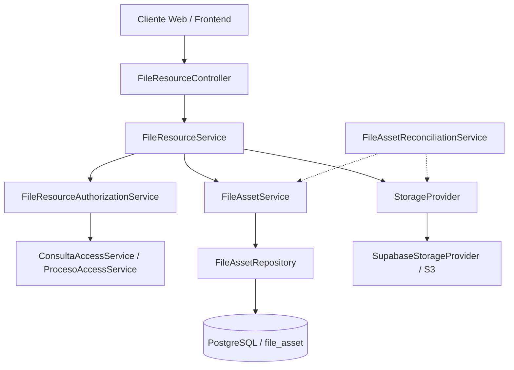
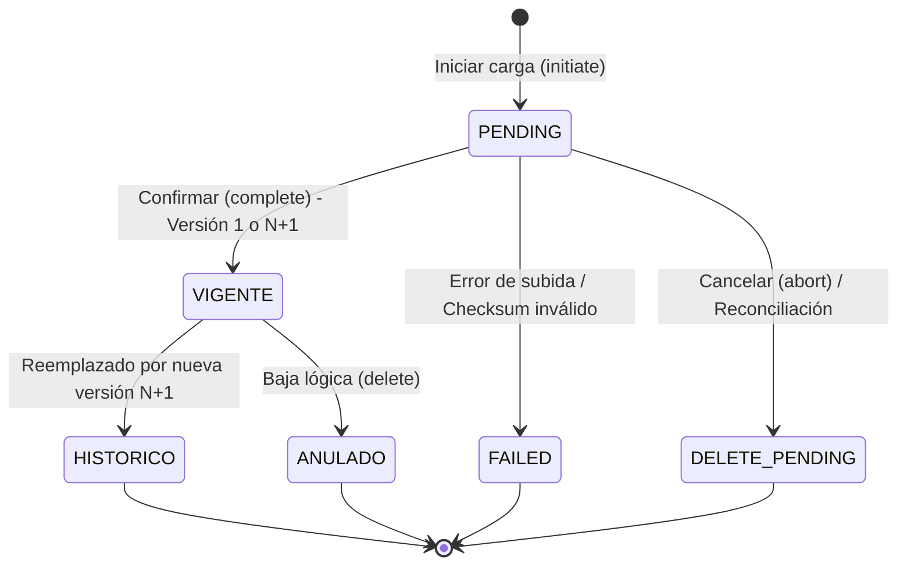

# Backend - Archivos y Gestión Documental del Expediente

> Documentación de la arquitectura interna, componentes Spring Boot, entidades JPA, servicios de negocio, control de concurrencia y reconciliación de almacenamiento.

---

## 1. Arquitectura General del Módulo

El módulo de gestión documental implementa un patrón desacoplado en capas, donde la lógica de negocio y las autorizaciones del dominio jurídico son completamente independientes del proveedor de almacenamiento físico:



---

## 2. Componentes Principales

| Componente | Paquete | Responsabilidad |
|---|---|---|
| `FileResourceController` | `file_storage.controller` | Endpoints REST bajo `/api` organizados por recursos del dominio (`/consultas/...`, `/seguimientos/...`, `/procesos/...`, `/conciliaciones/...`, `/file-uploads/...`, `/archivos/...`). |
| `FileResourceService` | `file_storage.service` | Orquesta la autorización de recursos, generación de claves canónicas, staging temporal, finalización idempotente y consulta agregada del expediente. |
| `FileResourceAuthorizationService` | `file_storage.service` | Intermediario que valida roles y alcance por tipo de recurso (`CONSULTA`, `SEGUIMIENTO`, `RESPUESTA`, `PROCESO`, `CONCILIACION`). |
| `FileAssetService` | `file_storage.service` | Gestiona el ciclo de vida de `FileAsset` en base de datos: creación en `PENDING`, promoción a `VIGENTE`, versionamiento secuencial $N+1$, bloqueo pesimista y paso a `HISTORICO`. |
| `FileAssetRepository` | `file_storage.repository` | Métodos JPA y JPQL avanzados: búsqueda por `uploadId`, versiones por `documentoLogico`, consultas de bloqueo pesimista y consulta agregada de expediente `findExpedienteFiles`. |
| `StorageProvider` | `file_storage.service` | Interfaz que define el contrato de almacenamiento: subida binaria, URLs presignadas de subida y descarga, verificación de existencia (`head`), cálculo de hash SHA-256 y eliminación física. |
| `SupabaseStorageProvider` | `file_storage.service` | Implementación compatible con la API S3 de Supabase Storage (o MinIO en entornos locales de prueba). |
| `FileAssetReconciliationService` | `file_storage.service` | Tarea programada (`@Scheduled`) que identifica cargas huérfanas en `PENDING` o `DELETE_PENDING` y compensa eliminando archivos incompletos del bucket. |
| `FileValidationService` | `file_storage.service` | Valida extensiones, nombres de archivo sanitizados y tipos MIME permitidos. |

---

## 3. Modelo de Datos y Versionamiento ($N+1$)

El modelo está respaldado por la entidad `FileAsset` (`file_asset`), migrada mediante Flyway (`V23`, `V25`, `V26`).

### Ciclo de vida de una versión documental



### Control de Concurrencia en Versionado

1. **Bloqueo Pesimista**: Cuando se solicita una nueva versión de un `documentoLogico` existente, el método `findVigenteForUpdate(documentoLogico)` adquiere un bloqueo pesimista de escritura (`PESSIMISTIC_WRITE`) a nivel de fila en PostgreSQL (`SELECT ... FOR UPDATE`).
2. **Cálculo Secuencial Server-Side**: La nueva versión se calcula evaluando la versión máxima persistida ($N+1$), sin permitir que el cliente decida o suministre el número de versión.
3. **Garantía en Base de Datos**: El índice único parcial `uk_file_asset_doc_vigente` (`CREATE UNIQUE INDEX uk_file_asset_doc_vigente ON file_asset (documento_logico) WHERE status = 'VIGENTE';`) imposibilita físicamente que dos transacciones simultáneas dejen dos versiones activas para el mismo documento lógico.

---

## 4. Flujo Idempotente de Carga

1. **Iniciación (`initiate`)**:
   - Se valida permiso y alcance sobre el recurso funcional.
   - Si es un reemplazo, se valida que el `documentoLogico` exista y pertenezca al mismo recurso.
   - Se genera un `uploadId` (UUID) y se inserta un registro en estado `PENDING`.
   - Se genera una clave física interna no colisionable: `{recurso}/{id}/{uuid}_{nombreSanitizado}`.
   - Se retorna el `uploadId` y la URL presignada de subida física.
2. **Subida Física**: El cliente transfiere los bytes directamente al almacenamiento privado de objetos mediante HTTP PUT.
3. **Completado (`complete`)**:
   - Se consulta el registro por `uploadId`.
   - **Idempotencia**: Si el registro ya se encuentra en estado `VIGENTE`, se retorna de inmediato el DTO existente sin ejecutar mutaciones adicionales.
   - Si está en `PENDING`, se comprueba la existencia física del objeto en el bucket, se valida su tamaño y se calcula/compara la suma SHA-256.
   - Se promueve atómicamente a `VIGENTE` y, si correspondía a un reemplazo, la versión anterior pasa a `HISTORICO` registrando la relación `referencia_anterior_id`.
   - Si ocurre una excepción, la transacción de base de datos se revierte y el objeto huérfano se marca para limpieza segura.

---

## 5. Consulta Documental Agregada por Expediente

El endpoint `GET /api/consultas/{consultaId}/expediente/archivos` resuelve el acervo documental completo del caso mediante el método de repositorio:

```java
@Query("SELECT f FROM FileAsset f " +
       "LEFT JOIN FETCH f.uploadedBy " +
       "WHERE f.active = true AND f.status = 'VIGENTE' AND (" +
       "  (f.resourceType = 'CONSULTA' AND f.resourceId = :consultaId) OR " +
       "  (f.resourceType = 'SEGUIMIENTO' AND f.resourceId IN (SELECT s.id FROM Seguimiento s WHERE s.consulta.id = :consultaId AND s.activo = true)) OR " +
       "  (f.resourceType = 'RESPUESTA' AND f.resourceId IN (SELECT r.id FROM SeguimientoRespuesta r WHERE r.seguimiento.consulta.id = :consultaId AND r.activo = true)) OR " +
       "  (f.resourceType = 'PROCESO' AND f.resourceId IN (SELECT p.id FROM Proceso p WHERE p.consulta.id = :consultaId AND p.activo = true)) OR " +
       "  (f.resourceType = 'CONCILIACION' AND f.resourceId IN (SELECT c.id FROM Conciliacion c WHERE c.consulta.id = :consultaId AND c.activo = true))" +
       ") " +
       "ORDER BY f.createdAt DESC, f.id DESC")
List<FileAsset> findExpedienteFiles(@Param("consultaId") Long consultaId);
```

### Características de Rendimiento y Seguridad

- **Prevención del problema N+1**: La cláusula `LEFT JOIN FETCH f.uploadedBy` carga de manera anticipada los datos de autoría de los usuarios en una única sentencia SQL.
- **Aislamiento de Expedientes**: La subconsulta vincula estrictamente cada recurso hijo (`Seguimiento`, `SeguimientoRespuesta`, `Proceso`, `Conciliacion`) a la consulta raíz, impidiendo filtraciones entre expedientes distintos.
- **Filtros en memoria**: Los filtros opcionales (`tipoDocumental`, `resourceType`, `origen`, `autor`, fechas) se aplican sobre el flujo de datos validado antes de retornar la proyección segura `ExpedienteDocumentoResponse`.

---

## 6. Configuración de Entorno y Almacenamiento

El módulo soporta múltiples perfiles de despliegue mediante variables de entorno en `application.properties`:

```properties
# Configuración del proveedor de almacenamiento
file.storage.provider=${FILE_STORAGE_PROVIDER:supabase}
supabase.storage.endpoint=${SUPABASE_STORAGE_ENDPOINT}
supabase.storage.region=${SUPABASE_STORAGE_REGION:us-east-1}
supabase.storage.access-key=${SUPABASE_STORAGE_ACCESS_KEY}
supabase.storage.secret-key=${SUPABASE_STORAGE_SECRET_KEY}
supabase.storage.bucket=${SUPABASE_STORAGE_BUCKET:legal-documents}

# Tamaño máximo admitido
spring.servlet.multipart.max-file-size=10MB
spring.servlet.multipart.max-request-size=10MB
```

En pruebas locales e integración se utiliza `LocalStorageProvider` o MinIO con bucket privado y credenciales locales seguras.
