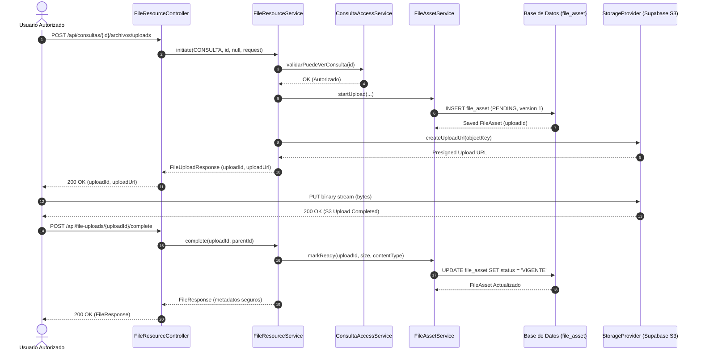

# Especificación de Requisitos y Trazabilidad Documental: SRS, Product Backlog y Casos de Uso

> Documento alineado con el Informe Final ([`.env.informe_final.docx`](file:///home/anorak/Code/ingsoftware/Sistema-de-consultorio-juridico/.env.informe_final.docx)), el código fuente implementado y las migraciones de base de datos Flyway (`V23__create_file_asset_table.sql`, `V25__migrate_existing_files_to_file_asset.sql`, `V26__add_document_versioning_and_metadata.sql`).

---

## 1. Contexto y Objetivos

La gestión documental del Sistema de Gestión de Casos Jurídicos del Consultorio Jurídico proporciona un acervo probatorio íntegro, versionado, auditable y seguro para los procesos jurídicos, consultas, conciliaciones y actuaciones de seguimiento.

Este documento formaliza la ingeniería de requisitos correspondiente a:
1. **Requerimientos Funcionales del SRS** (RF16, RF17, RF18, RF19, RF20, RF21, RF59, RF78, RF79, RF80).
2. **Historias de Usuario del Product Backlog** (PB-27, PB-28, PB-29).
3. **Casos de Uso Detallados** (CU-10: *Administrar y consultar acervo probatorio y documental del expediente*).

---

## 2. Requerimientos Funcionales del SRS

### RF16 — Cargar archivo asociado

| Atributo | Detalle |
|---|---|
| **Identificador** | `RF16` |
| **Nombre** | Cargar archivo asociado a recursos del dominio |
| **Módulo** | Gestión Documental / Archivos |
| **Prioridad** | Muy alta |
| **Descripción** | El sistema debe permitir cargar archivos asociados a una consulta, seguimiento, respuesta de seguimiento, proceso jurídico o trámite de conciliación mediante un flujo seguro en dos pasos (iniciación y completado) con almacenamiento privado de objetos, sin admitir rutas arbitrarias o libres proporcionadas por el cliente. |
| **Entradas** | Tipo de recurso (`CONSULTA`, `SEGUIMIENTO`, `RESPUESTA`, `PROCESO`, `CONCILIACION`), ID del recurso, ID del padre (opcional para respuestas), metadatos del archivo (`originalFileName`, `contentType`, `size`). |
| **Salidas** | `uploadId` (UUID público de sesión), URL de carga segura (presigned upload URL) o confirmación de subida física. |
| **Reglas asociadas** | 1. El cliente no define nombres internos (`objectKey`), rutas de almacenamiento ni buckets.<br>2. Se rechazan nombres con secuencias `..` o caracteres de escape.<br>3. Se valida que el tamaño no exceda 10 MB y que el tipo MIME esté admitido.<br>4. Se registra inicialmente en estado `PENDING`. |

---

### RF17 — Consultar archivo asociado

| Atributo | Detalle |
|---|---|
| **Identificador** | `RF17` |
| **Nombre** | Consultar archivo asociado y metadatos documentales |
| **Módulo** | Gestión Documental / Archivos |
| **Prioridad** | Alta |
| **Descripción** | El sistema debe permitir consultar los metadatos de los archivos asociados a un recurso funcional y consultar la lista de versiones vigentes o históricas de un documento lógico. |
| **Salidas** | DTO seguro con `fileId`, `uploadId`, `originalFileName`, `contentType`, `fileSize`, `checksum`, `documentoLogico`, `version`, `status`, `tipoDocumental`, `origen`, `uploadedByUsername`, `createdAt`. |
| **Restricción de seguridad** | Las respuestas públicas nunca exponen claves físicas del bucket (`objectKey`) ni el nombre del bucket de almacenamiento. |

---

### RF18 — Descargar archivo asociado

| Atributo | Detalle |
|---|---|
| **Identificador** | `RF18` |
| **Nombre** | Descargar archivo del sistema de forma segura |
| **Módulo** | Gestión Documental / Archivos |
| **Prioridad** | Muy alta |
| **Descripción** | El sistema debe permitir descargar archivos previamente cargados generando un enlace de descarga firmado y de corta duración (máximo 15 minutos) o mediante un flujo protegido en streaming que valide previamente la autenticación del usuario y su alcance sobre el expediente. |
| **Respuestas** | `200 OK` con URL presignada temporal / `403 Forbidden` si el usuario no tiene alcance sobre el expediente / `404 Not Found` si el archivo no existe o está inactivo. |

---

### RF19 — Cerrar consulta jurídica y preservación probatoria

| Atributo | Detalle |
|---|---|
| **Identificador** | `RF19` |
| **Nombre** | Cerrar consulta jurídica |
| **Módulo** | Consultas jurídicas / Cierre |
| **Prioridad** | Muy alta |
| **Descripción** | El sistema debe permitir cerrar una consulta jurídica indicando motivo, conclusión o resultado final, verificando que no existan actuaciones pendientes y asegurando la inmutabilidad de todos los documentos y evidencias probatorias adjuntas al expediente. |
| **Condición documental** | Una vez cerrada la consulta, los documentos del expediente quedan bloqueados para modificaciones o nuevas versiones destructivas; todo el acervo se preserva para consulta histórica. |

---

### RF20 — Controlar acceso por permisos y alcance

| Atributo | Detalle |
|---|---|
| **Identificador** | `RF20` |
| **Nombre** | Controlar acceso por permisos y alcance institucional |
| **Módulo** | Seguridad / Autorización |
| **Prioridad** | Muy alta |
| **Descripción** | El sistema debe controlar el acceso a la carga, descarga, listado y consulta documental según los roles y permisos del usuario autenticado, cruzando la autorización con el alcance del caso mediante `FileResourceAuthorizationService` y los servicios de acceso específicos (`ConsultaAccessService`, etc.). |
| **Restricciones** | Los usuarios no pueden consultar ni descargar documentos de consultas o procesos ajenos a su asignación, respondiendo de manera consistente con `403 Forbidden` (o `404 Not Found` según la política de opacidad). |

---

### RF21 — Crear proceso jurídico e integrar recursos procesales

| Atributo | Detalle |
|---|---|
| **Identificador** | `RF21` |
| **Nombre** | Crear proceso jurídico derivado de consulta |
| **Módulo** | Procesos Judiciales |
| **Prioridad** | Alta |
| **Descripción** | El sistema debe permitir crear procesos judiciales derivados de consultas activas, incorporando `PROCESO` como tipo de recurso de primer nivel dentro del subsistema documental y enlazando las piezas procesales cargadas directamente con el expediente raíz. |

---

### RF59 — Crear perfil de estudiante / Trazabilidad de autoría

| Atributo | Detalle |
|---|---|
| **Identificador** | `RF59` |
| **Nombre** | Trazabilidad de autoría y perfiles en el acervo documental |
| **Módulo** | Usuarios / Estudiantes / Auditoría |
| **Prioridad** | Muy alta |
| **Descripción** | El sistema debe vincular de forma inmutable cada documento cargado o versionado con el usuario autenticado (`uploaded_by_id`), registrando su nombre de usuario, rol institucional y perfil real (estudiante practicante, asesor docente, monitor, etc.). |
| **Invariante** | El cliente no puede suministrar ni manipular el autor del archivo ni su origen (`CARGA_USUARIO`, `SISTEMA`, `MIGRADO`). |

---

### RF78, RF79, RF80 — Operaciones de subida individual, múltiple y descarga

- **RF78 (Subir archivo individual)**: Carga unitaria con cálculo de hash criptográfico SHA-256 en servidor y asignación automática de versión 1 o $N+1$.
- **RF79 (Subir múltiples archivos)**: Soporte de subida concurrente por lotes, procesando cada archivo de forma atómica.
- **RF80 (Descargar archivo del sistema)**: Entrega segura de contenidos binarios respetando tipos MIME y cabeceras `Content-Disposition`.

---

## 3. Historias de Usuario del Product Backlog (PB)

### PB-27 (HU-27 / HU-31) — Modelo documental versionado y migración de metadatos

```gherkin
Criterios de Aceptación (PB-27):

Escenario: Primera versión de un documento
  Dado un recurso del dominio (Consulta, Seguimiento, Respuesta, Proceso o Conciliación)
  Cuando se completa la carga de un archivo por primera vez
  Entonces el sistema asigna un identificador único de documento lógico (documentoLogico)
  Y asigna el número de versión igual a 1
  Y el estado inicial es VIGENTE
  Y el origen se calcula como CARGA_USUARIO en el servidor
  Y se almacena la suma de verificación SHA-256.

Escenario: Nueva versión de un documento existente (Reemplazo controlado)
  Dado un documento lógico existente en estado VIGENTE con versión N
  Cuando un usuario autorizado carga un archivo indicando el reemplazo de dicho documento
  Entonces el sistema genera una nueva fila con el mismo documentoLogico y versión N+1
  Y asocia referencia_anterior_id a la versión N
  Y la versión anterior pasa a estado HISTORICO (inmutable)
  Y la nueva versión queda en estado VIGENTE
  Y un índice único parcial en base de datos impide la concurrencia de dos versiones VIGENTES simultáneas.
```

---

### PB-28 (HU-28 / HU-34) — Flujo idempotente de carga y compensación

```gherkin
Criterios de Aceptación (PB-28):

Escenario: Reintento idempotente de finalización de carga
  Dado un uploadId que ya fue completado exitosamente previamente
  Cuando el cliente reintenta enviar la solicitud de completado (/api/file-uploads/{uploadId}/complete)
  Entonces el servicio no duplica el registro en base de datos
  Y retorna inmediatamente el mismo FileResponse previamente generado con código 200 OK.

Escenario: Falla de almacenamiento o cancelación de subida
  Dado un upload en estado PENDING que no se completó en el tiempo límite o fue cancelado
  Cuando se ejecuta la tarea de reconciliación periódica o el endpoint DELETE /api/file-uploads/{uploadId}
  Entonces el registro se marca como FAILED o DELETE_PENDING
  Y se compensa eliminando el objeto huérfano del bucket de almacenamiento
  Y los archivos en estado incompleto nunca son visibles en los listados del expediente.
```

---

### PB-29 (HU-29 / HU-32 / HU-33) — Consulta documental agregada por expediente

```gherkin
Criterios de Aceptación (PB-29):

Escenario: Consulta integral del acervo probatorio del expediente
  Dado una consulta jurídica con identificador {consultaId}
  Y que posee documentos asociados directamente y a través de sus seguimientos, respuestas, procesos y conciliaciones
  Cuando un usuario autorizado consulta GET /api/consultas/{consultaId}/expediente/archivos
  Entonces el sistema valida previamente el alcance del usuario sobre la consulta
  Y retorna la totalidad de los documentos vigentes vinculados a todas las ramas del caso
  Y cada registro indica su entidad de origen, tipo documental, versión y autor
  Y la consulta se ejecuta en una sola sentencia SQL optimizada (sin problema N+1)
  Y los resultados se ordenan cronológicamente descendente por fecha de creación e ID.

Escenario: Filtros combinados sobre el acervo documental
  Dado el endpoint del expediente
  Cuando se proporcionan filtros opcionales (tipoDocumental, resourceType, origen, autor, fechaDesde, fechaHasta)
  Entonces el sistema aplica los predicados correspondientes sobre el conjunto agregado
  Y no expone en ningún caso documentos pertenecientes a expedientes ajenos.
```

---

## 4. Caso de Uso Detallado: CU-10

### Ficha Técnica del Caso de Uso

| Elemento | Descripción |
|---|---|
| **Código** | `CU-10` |
| **Nombre** | Administrar y consultar acervo probatorio y documental del expediente |
| **Actores Principales** | Estudiante Practicante, Asesor Docente, Monitor, Conciliador, Administrativo |
| **Propósito** | Gestionar de forma segura, estructurada e inmutable todos los documentos, pruebas, actuaciones, memoriales y actas que conforman el expediente jurídico de una consulta. |
| **Precondiciones** | 1. El usuario debe estar autenticado con sesión válida en el sistema.<br>2. El usuario debe tener asignado el rol y permiso correspondiente sobre el recurso.<br>3. La consulta o expediente solicitado debe estar activo o en estado permitido para lectura. |
| **Postcondiciones** | Los archivos quedan almacenados en el bucket privado, con metadatos registrados en `file_asset`, versión calculada en servidor, suma SHA-256 verificada y trazabilidad completa en auditoría. |

### Diagrama de Secuencia Conceptual



### Flujo Básico (Happy Path)

1. El usuario accede al detalle de un expediente o actuación y solicita adjuntar un nuevo documento.
2. El cliente frontend envía la solicitud de iniciación con el nombre original, tipo MIME y tamaño previsto.
3. El backend verifica la identidad y el alcance del usuario sobre la consulta raíz.
4. El servicio genera un `documentoLogico` nuevo (versión 1) y registra el `FileAsset` en estado `PENDING`.
5. El cliente sube físicamente los bytes al almacenamiento de objetos mediante la URL presignada o streaming multipart.
6. El cliente notifica la finalización mediante `/complete`.
7. El servidor valida la presencia física del objeto, verifica el tamaño real y calcula/compara la suma SHA-256.
8. La base de datos actualiza el estado a `VIGENTE` bajo control transaccional.
9. El documento queda disponible de inmediato para todos los participantes con alcance sobre el expediente.

### Flujos Alternos

- **Flujo Alterno A: Carga de nueva versión (reemplazo)**
  1. En el paso 2, el cliente envía la referencia al `documentoLogico` existente o archivo anterior.
  2. El servidor bloquea de forma pesimista la versión actual (`SELECT ... FOR UPDATE`).
  3. El servidor calcula la nueva versión como $N+1$.
  4. Al completarse la carga, la versión anterior pasa a `HISTORICO` y la nueva versión pasa a `VIGENTE`.
  5. El índice único parcial `uk_file_asset_doc_vigente` garantiza que solo exista una versión vigente.

- **Flujo Alterno B: Reintento por desconexión de red**
  1. Si la llamada a `/complete` se repite con el mismo `uploadId`, el servidor detecta que el registro ya está `VIGENTE`.
  2. Devuelve de inmediato el DTO existente con código `200 OK` (idempotencia estricta).

- **Flujo Alterno C: Cancelación explícita**
  1. El cliente o el usuario cancela la subida llamando a `DELETE /api/file-uploads/{uploadId}`.
  2. El servidor marca el registro como `FAILED` / `DELETE_PENDING` y elimina cualquier fragmento subido al bucket.

### Excepciones y Manejo de Errores

- **401 Unauthorized**: La petición no contiene token JWT o la sesión expiró.
- **403 Forbidden**: El usuario no está asignado como estudiante, asesor, monitor o directivo con alcance sobre el expediente.
- **404 Not Found**: El expediente o el `uploadId` especificado no existe.
- **409 Conflict**: Conflicto de versiones concurrentes al intentar promover dos versiones vigentes en paralelo.
- **503 Service Unavailable**: El proveedor de almacenamiento privado no se encuentra disponible temporalmente; la transacción de metadatos se compensa y revierte de forma limpia.
