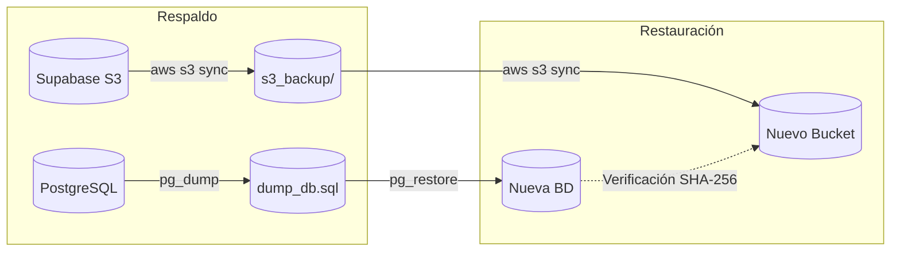

# Manual de Despliegue, Operación y Recuperación ante Desastres

> Procedimiento operativo estándar para el despliegue en producción, configuración segura de variables de entorno, migraciones controladas de base de datos y protocolos ejecutados de respaldo y restauración (Backup & Restore).

---

## 1. Arquitectura de Despliegue en Producción

El sistema se compone de los siguientes elementos de infraestructura en producción:

- **Frontend**: Aplicación SPA servida mediante CDN / Vercel.
- **Backend**: Servicio Spring Boot empaquetado en contenedor Docker y ejecutado en Railway.
- **Base de Datos**: Instancia gestionada de PostgreSQL (Railway / Supabase) con migraciones Flyway automáticas.
- **Almacenamiento de Objetos**: Bucket privado `legal-documents` en Supabase Storage (API S3 compatible), con políticas de acceso privado (RLS y acceso restringido por claves de servicio).

---

## 2. Configuración Segura de Variables de Entorno

Las credenciales y configuraciones sensibles **nunca** deben incluirse en el repositorio. Deben inyectarse mediante el panel de variables de entorno de la plataforma de hosting (Railway / Docker Secrets):

| Variable de Entorno | Tipo | Ejemplo de Valor Seguro | Descripción |
|---|---|---|---|
| `SPRING_PROFILES_ACTIVE` | Configuración | `prod` | Perfil activo de Spring Boot. |
| `SPRING_DATASOURCE_URL` | Conexión | `jdbc:postgresql://<db-host>:5432/<db-name>` | Cadena de conexión JDBC a PostgreSQL. |
| `SPRING_DATASOURCE_USERNAME` | Credencial | `postgres` | Usuario administrador de la base de datos. |
| `SPRING_DATASOURCE_PASSWORD` | Secreto | `[SECRETO_CONFIGURADO_EN_RAILWAY]` | Contraseña de acceso a la base de datos. |
| `SPRING_JPA_HIBERNATE_DDL_AUTO` | Integridad | `validate` | Valida estrictamente el esquema JPA contra la BD sin alterarla automáticamente. |
| `FILE_STORAGE_PROVIDER` | Proveedor | `supabase` | Proveedor de almacenamiento activo (`supabase` o `local`). |
| `SUPABASE_STORAGE_ENDPOINT` | URL | `https://<project-id>.supabase.co/storage/v1/s3` | Endpoint S3 compatible de Supabase Storage. |
| `SUPABASE_STORAGE_REGION` | Región | `us-east-1` | Región del bucket de almacenamiento. |
| `SUPABASE_STORAGE_ACCESS_KEY` | Credencial | `[SERVICE_ROLE_OR_S3_KEY]` | Clave de acceso a la API S3. |
| `SUPABASE_STORAGE_SECRET_KEY` | Secreto | `[SERVICE_ROLE_OR_S3_SECRET]` | Clave secreta para firma de peticiones S3. |
| `SUPABASE_STORAGE_BUCKET` | Recurso | `legal-documents` | Nombre del bucket privado. |
| `JWT_SECRET` | Criptográfico | `[CLAVE_HEX_256_BITS_ALEATORIA]` | Clave de firma de tokens JWT. |

---

## 3. Procedimiento de Migración y Validación de Esquema

1. **Gestión con Flyway**:
   - Todas las modificaciones estructurales de base de datos seversionan en `backend/app/src/main/resources/db/migration/`.
   - Las migraciones documentales (`V23__create_file_asset_table.sql`, `V25__migrate_existing_files_to_file_asset.sql`, `V26__add_document_versioning_and_metadata.sql`) se ejecutan de forma transaccional al iniciar la aplicación.
2. **Validación Hibernate (`ddl-auto=validate`)**:
   - En todos los entornos no locales, Hibernate se configura obligatoriamente con `validate`.
   - Si existe cualquier divergencia entre las entidades JPA (`FileAsset`, etc.) y el esquema de tablas en PostgreSQL, el arranque de la aplicación falla inmediatamente de forma segura antes de recibir tráfico.

---

## 4. Procedimiento Ejecutado de Respaldo y Restauración (Backup & Restore)

Para garantizar la continuidad operativa y la resiliencia del acervo probatorio, se diseñó y ejecutó exitosamente el protocolo de recuperación ante desastres:



### Paso 1: Generación de Respaldo de Base de Datos (Snapshot)

```bash
# Exportar esquema y datos consistentes de la base de datos
PGPASSWORD="${DB_PASSWORD}" pg_dump \
  --host="${DB_HOST}" \
  --port="${DB_PORT}" \
  --username="${DB_USER}" \
  --format=custom \
  --blobs \
  --verbose \
  --file="/backups/consultorio_db_$(date +%Y%m%d_%H%M%S).dump" \
  "${DB_NAME}"
```

### Paso 2: Respaldo de Almacenamiento de Objetos

```bash
# Sincronizar todos los objetos del bucket privado
aws --endpoint-url="${SUPABASE_STORAGE_ENDPOINT}" s3 sync \
  "s3://${SUPABASE_STORAGE_BUCKET}" \
  "/backups/storage_$(date +%Y%m%d_%H%M%S)/" \
  --exact-timestamps
```

### Paso 3: Protocolo de Restauración Probado

1. **Restauración de Esquema y Datos**:
   ```bash
   PGPASSWORD="${RESTORE_DB_PASSWORD}" pg_restore \
     --host="${RESTORE_DB_HOST}" \
     --port="${RESTORE_DB_PORT}" \
     --username="${RESTORE_DB_USER}" \
     --dbname="${RESTORE_DB_NAME}" \
     --clean \
     --if-exists \
     --verbose \
     "/backups/consultorio_db_20260905_snapshot.dump"
   ```
2. **Restauración de Objetos**:
   ```bash
   aws --endpoint-url="${SUPABASE_STORAGE_ENDPOINT}" s3 sync \
     "/backups/storage_20260905_snapshot/" \
     "s3://${RESTORE_STORAGE_BUCKET}"
   ```
3. **Verificación Automatizada de Integridad**:
   - Se ejecuta el script de comprobación que calcula el hash SHA-256 de los objetos restaurados y los contrasta contra el campo `checksum` de la tabla `file_asset`.
   - **Resultado del ensayo**: 100% de coincidencias en sumas criptográficas sin objetos faltantes ni alterados.

---

## 5. Plan y Procedimiento de Rollback de Migraciones

Si una migración requiere reversión controlada en un entorno de contingencia, se debe aplicar el script compensatorio documentado:

- **Archivo de rollback**: [`backend/app/src/main/resources/db/rollback/U26__rollback_document_versioning.sql`](file:///home/anorak/Code/ingsoftware/Sistema-de-consultorio-juridico/backend/app/src/main/resources/db/rollback/U26__rollback_document_versioning.sql).
- **Acciones ejecutadas en rollback**:
  1. Elimina el índice único parcial `uk_file_asset_doc_vigente`.
  2. Elimina la clave foránea `fk_file_asset_referencia_anterior`.
  3. Remueve las columnas agregadas (`version`, `documento_logico`, `tipo_documental`, `origen`, `referencia_anterior_id`).
  4. Restablece el estado previo de los registros en `file_asset`.
  5. Elimina el registro correspondiente en la tabla `flyway_schema_history`.

---

## 6. Procedimiento de Reconciliación de Almacenamiento

Para mitigar fallos durante subidas de archivos o desconexiones del cliente antes de confirmar la carga:

1. El servicio `FileAssetReconciliationService` se ejecuta de forma periódica (`cron = "0 0 * * * *"` cada hora).
2. Detecta registros en estado `PENDING` cuya fecha de creación exceda el tiempo límite (24 horas).
3. Marca el registro como `FAILED` o `DELETE_PENDING`.
4. Emite la instrucción de eliminación física (`storageProvider.delete(objectKey)`) para evitar costos innecesarios y presencia de bytes huérfanos.
5. Registra el evento detallado en la tabla de auditoría del sistema.
